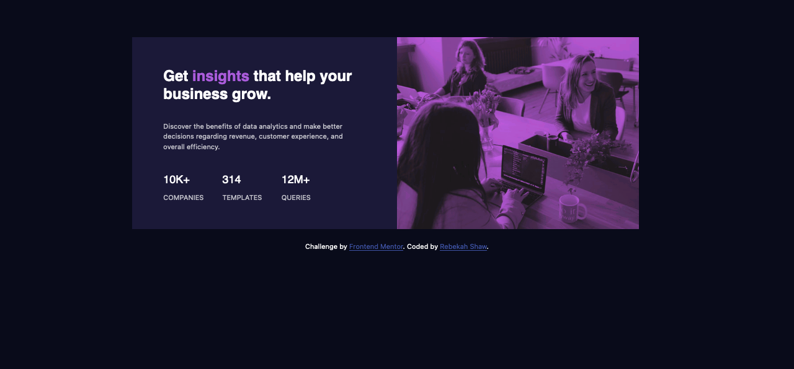
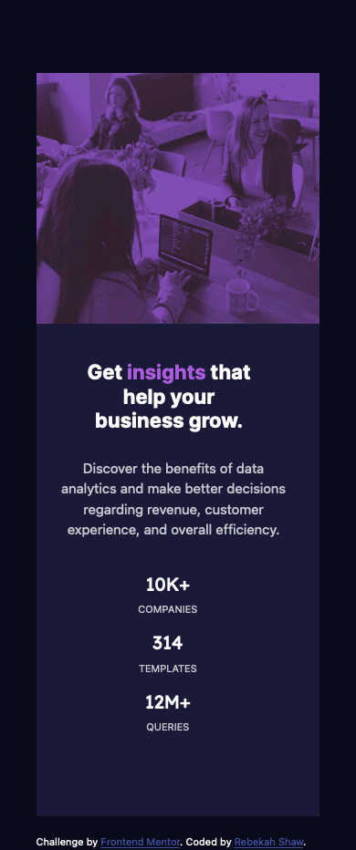

# Frontend Mentor - Stats preview card component

This is a solution to the [Stats preview card component challenge on Frontend Mentor](https://www.frontendmentor.io/challenges/stats-preview-card-component-8JqbgoU62). Frontend Mentor challenges help you improve your coding skills by building realistic projects. 

## Table of contents

- [Overview](#overview)
  - [The challenge](#the-challenge)
  - [Screenshot](#screenshot)
  - [Links](#links)
- [My process](#my-process)
  - [Built with](#built-with)
  - [What I learned](#what-i-learned)
  - [Continued development](#continued-development)
  - [Useful resources](#useful-resources)
- [Author](#author)

## Overview

### The challenge

Users should be able to:

- View the optimal layout depending on their device's screen size

### Screenshot

#### Desktop

#### Mobile

### links

- Solution URL: [Solution](https://github.com/rebekahshaw92/stats_preview_card_component)
- Live Site URL: [Live Site](https://rebekahshaw92.github.io/stats_preview_card_component/)

## My process

### Built with

- Semantic HTML5 markup 
- CSS custom properties
- Bootstrap 5
- Sass

### What I learned

While undertaking this challenge I learned how to create and add shadows in css and how to style buttons using css and how to hide and show parts of my css. 

### Continued development

I would like to continue working with both css and bootstrap and futher my already growing skillest in working with both.

### Useful resources

- [Bootstrap](https://getbootstrap.com) -  This site helped me to learn everything I need to know about bootstrap.

## Author

- Website - [Rebekah Shaw](https://rebekahshaw.com)
- Frontend Mentor - [@rebekahshaw92](https://www,frontendmentor.io/profile/rebekahshaw92)
